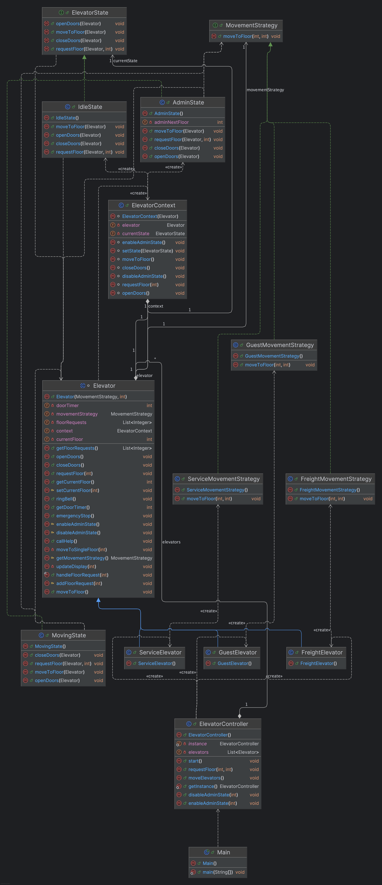

<h1>Bluestaq Code Challenge - Elevator Simulation</h1>

  <h2>Assumptions:</h2>
  <ol>
    <li>
      Hard coded 1 freight, 1 guest, and 1 service elevator. If we were to
      use this solution for multiple buildings that may have different number of
      elevators, then I would use a XML or JSON configuration file to define the
      elevators for each implementation. Or implement an Admin GUI.
    </li>
    <li>
      Floor requests only accept integers and do not account for basement or
      "B" or penthouse "P" values.
    </li>
    <li>
      Move to floor is only FIFO. For example, elevator won't stop on floor
      8 if moving to floor 10. Could be optimized.
    </li>
    <li>
      There are no external up / down buttons for floors.
    </li>
    <li>Console driven. Could add a GUI for simulation.</li>
    <li>No junit test scripts.</li>
  </ol>

  <h2>Design patterns:</h2> 
  Attempted to build a solution that showcased numerous design
  patterns. In this challenge you will see examples of the Singleton, Strategy,
  State, and Template design patterns. The MovementStrategy might not be the
  best fit for the strategy design pattern, however I wanted to include it more
  for the pattern and not so much the logic. Other design patterns that I am
  familiar with that are not included in this challenge are Factory, Builder,
  and Decorator. And also Wrapper, although not technically a design pattern.

  <h2>Comments:</h2> 
  Excluded most comments in favor of clean code. Have had projects
  managers and professors that either love or hate comments. For this code
  challenge, I followed the basic principles from the book Clean Code by Robert
  Martin.

  <h2>UML:</h2>

